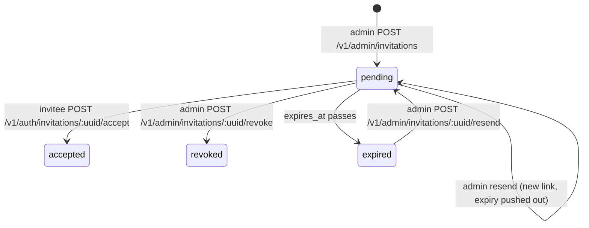
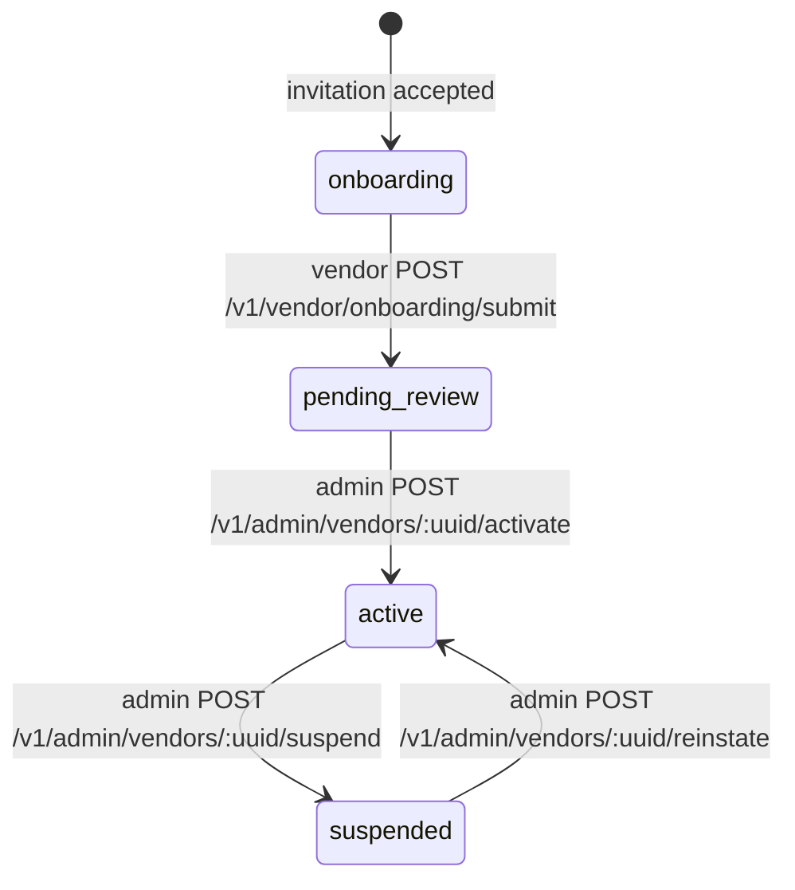
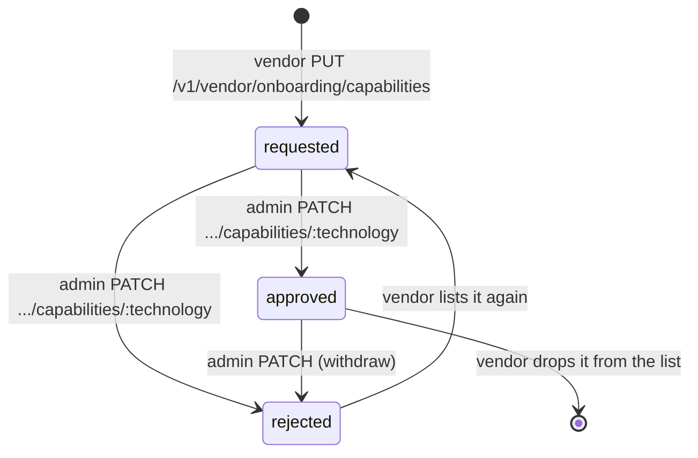
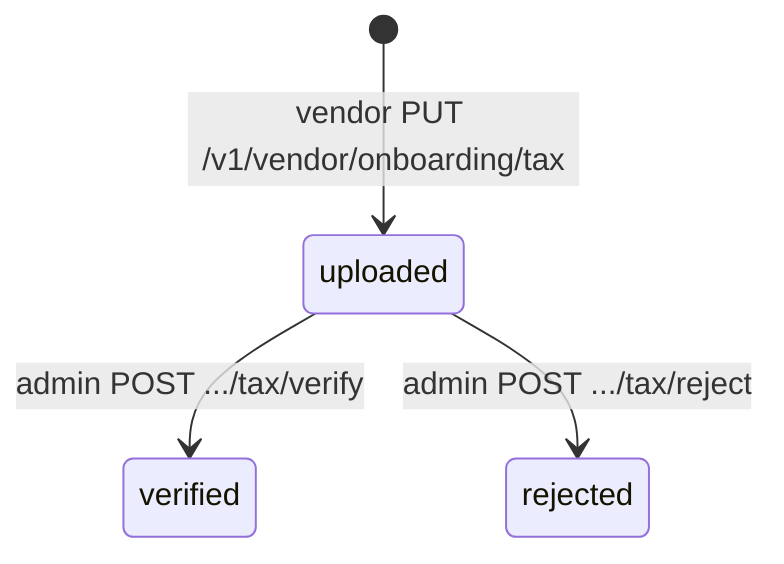

# Vendor Onboarding

How a manufacturer goes from "MakeXYZ wants to work with them" to "receiving orders". This is the reference for changing the flow and for building its frontend. Update it in the same PR as any change to invitations, vendor onboarding, or vendor gating.

For the order/payout lifecycle a live vendor takes part in, see [DATABASE_FLOW.md](./DATABASE_FLOW.md).

---

# Overview

## Why onboarding exists

A vendor only works if a set of records exist around it:

* **Technology capabilities.** These drive order routing and whether a quote is fulfillable.
* **A ready payout method.** Required to accept an order.
* **A payout rate for every material they'll make.** Also required to accept an order.
* **Business records:** a business address, a signed vendor agreement, and tax forms.

Without a gate, a half-set-up vendor would still count as "capable". That makes quotes look fulfillable and pushes orders into the preferred window for a vendor who can't actually accept them. Onboarding collects everything up front, and **only active vendors with approved capabilities count** for routing, acceptance, and staff project access.

## Who does what

| Actor | Does |
|---|---|
| Admin | Invites the vendor. Reviews the submission: approves capabilities, verifies tax forms, sets payout rates. Activates, suspends, and reinstates. |
| Vendor | Accepts the invitation (chooses a password). Fills in the profile, business address, capabilities, agreement, tax forms, and payout method. Submits for review. |

## Two separate stages

1. **Invitation** (`invitations` table). There is no user account yet. The invitee proves they received the link and chooses a password. Accepting creates the `users` row **and** the `vendors` row in one transaction.
2. **Vendor onboarding** (`vendors.status`). The account exists and is logged in. The vendor completes their checklist, then an admin reviews and activates.

There is no half-created user: `users.password` is never null, because the user doesn't exist until the invitee chooses one.

---

# State machines

## Invitation

Status is **derived**, not stored: it comes from `accepted_at`, `revoked_at`, and `expires_at`.



## Vendor (`vendors.status`)



## Capability (`vendor_technology_capabilities.status`)



`is_preferred` is admin-only, and it's forced off when a capability isn't approved.

## Tax document (`vendor_tax_documents`)



Every upload is a new row, and the **latest row is the current document**. Re-uploading after a rejection, or at any time, starts a fresh `uploaded` document.

---

# Frontend routing rules

## Invitation page

1. The admin shares `${ACCOUNT_INVITE_URL}?link=<url-encoded signed API path>`. Once mail exists, this link goes in an email instead.
2. The page reads `link` and **GETs it as-is** against the API: `GET /v1/auth/invitations/:uuid?signature=…` (the expiry is sealed inside the signature).
   * `200`: prefill the form. `email` is read-only and `role` is shown for context. Keep `data.acceptUrl`.
   * `403`: the link is invalid or tampered with ("This link is invalid").
   * `410`: `reason` is `expired`, `revoked`, or `accepted` ("ask MakeXYZ for a new invite" / "already set up, log in").
3. On submit, **POST to `data.acceptUrl` exactly as given**, with `{ fullName?, password, passwordConfirmation }`. `acceptUrl` is separately signed and valid for 1 hour, so a page left open longer than that must re-fetch step 2.
4. On `200`, the user is logged in (web session cookie). Route them using the rules below.

The frontend never builds or edits these URLs. It only passes along what the server produced.

## After login / accept

`GET /v1/account/profile`, `POST /v1/auth/login` and the invitation accept response all return the user with:

```json
"vendor": { "uuid": "…", "status": "onboarding", "onboardingComplete": false }
```

`vendor` is `null` for non-vendor users.

| `vendor.status` | `onboardingComplete` | Send the user to |
|---|---|---|
| `onboarding` | any | Onboarding checklist (`GET /v1/vendor/onboarding`) |
| `pending_review` | any | "Under review" page. The checklist stays editable (e.g. a rejected tax document or capability to fix). |
| `active` | `true` | Vendor dashboard |
| `active` | `false` | Vendor dashboard, with a blocking banner for the incomplete item. In practice that's a new agreement version to re-accept, or a payout method needing attention. The vendor can't accept new orders until it's fixed. |
| `suspended` | any | Vendor dashboard in read-only mode, with a suspension banner (`suspensionReason`). Accepted orders can still be produced and shipped. |

The redirect is only UX. The backend enforces every rule itself (see "What the gates check").

---

# Checklists

Both checklists are computed on the fly by `app/services/vendor_onboarding_service.ts`; nothing is stored. Each item is `{ key, complete, detail }`, where `detail` explains what's missing when `complete` is `false`.

## Vendor checklist (the vendor completes these)

`onboardingComplete` is `true` when every item here is complete. Submitting for review requires it.

| key | Complete when | Fixed with |
|---|---|---|
| `profile` | `displayName` and `legalName` are set | `PATCH /v1/vendor/onboarding/profile` |
| `address` | A **default** vendor address exists | `POST /v1/vendor/addresses` with `isDefault: true` (or `PATCH` an existing one) |
| `capabilities` | At least one capability is `requested` or `approved` | `PUT /v1/vendor/onboarding/capabilities` |
| `agreement` | `agreementVersion` equals the current `VENDOR_AGREEMENT_VERSION` | `POST /v1/vendor/onboarding/agreement` |
| `tax` | `taxClassification` is set, and the latest tax document isn't rejected | `PUT /v1/vendor/onboarding/tax` |
| `payout_method` | The payout method is ready (Stripe payouts enabled, or PayPal connected, with no `payoutMethodError`) | `/v1/vendor/payout-method/*` |

## Admin checklist (the admin completes these during review)

Activation requires **both** checklists to be complete.

| key | Complete when | Fixed with |
|---|---|---|
| `capabilities_reviewed` | At least one capability is `approved`, and none are still `requested` | `PATCH /v1/admin/vendors/:uuid/capabilities/:technology` |
| `tax_verified` | The latest tax document is verified | `POST /v1/admin/vendors/:uuid/tax/verify` |
| `payout_rates` | A payout rate exists for every material whose technology the vendor is approved for | `PUT /v1/admin/vendors/:uuid/payout-rates` |

`payout_rates` is the same rule acceptance applies per order (`computePayoutBreakdown`), checked ahead of time so an active vendor never hits "no payout rate for PLA" on their first order.

---

# Endpoint reference

All responses use the standard `{ data: … }` envelope. Auth values:
* **signed**: public, but the URL must carry a valid signature for purpose `invitation`
* **vendor**: a logged-in user with role `vendor` who has a vendor record
* **admin**: a logged-in user with role `admin`

## Invitation (public)

| Method & path | Auth | Body | Response | Errors |
|---|---|---|---|---|
| `GET /v1/auth/invitations/:uuid` | signed | – | `{ invitation: { uuid, email, role, expiresAt }, acceptUrl }` | `403` bad signature, `404`, `410 { reason }` |
| `POST /v1/auth/invitations/:uuid/accept` | signed | `{ fullName?, password, passwordConfirmation }` | `{ user }`, and logged in | `403`, `404`, `410 { reason }`, `409` email now in use, `422` validation |

## Invitations (admin)

| Method & path | Body / query | Response | Errors |
|---|---|---|---|
| `POST /v1/admin/invitations` | `{ email, role: 'vendor' \| 'admin' }` | `{ invitation, inviteUrl }` | `409 { error, existingRole, vendorUuid? }`, `422` |
| `GET /v1/admin/invitations` | `?status=pending\|accepted\|revoked\|expired` | `[invitation]` | – |
| `POST /v1/admin/invitations/:uuid/resend` | – | `{ invitation, inviteUrl }` | `404`, `409` already accepted/revoked |
| `POST /v1/admin/invitations/:uuid/revoke` | – | `invitation` | `404`, `409` already accepted/revoked (a pending or expired invite can be revoked) |

The admin `invitation` shape is `{ uuid, email, role, status, expiresAt, lastSentAt, acceptedAt, revokedAt, createdAt, invitedBy: { uuid, fullName, email } | null }`.

Posting the same email and role while a pending invite exists returns that invite with a fresh link. It doesn't create a duplicate.

## Onboarding (vendor)

Every endpoint returns the **onboarding payload**:

```
{ uuid, status, displayName, legalName, phone, taxClassification,
  submittedAt, activatedAt, suspendedAt, suspensionReason,
  agreement: { currentVersion, acceptedVersion, acceptedAt },
  capabilities: [{ technology, status, isPreferred, reviewedAt }],
  taxDocument: { uuid, formType, originalName, status, rejectedReason, createdAt } | null,
  checklist: [{ key, complete, detail }],
  onboardingComplete }
```

| Method & path | Body | Notes |
|---|---|---|
| `GET /v1/vendor/onboarding` | – | |
| `PATCH /v1/vendor/onboarding/profile` | `{ displayName?, legalName?, phone? }` | Allowed in any status except `suspended` |
| `PUT /v1/vendor/onboarding/capabilities` | `{ technologies: ('fdm'\|'sla'\|'sls')[] }` (at least 1) | Sets the full list. New or previously rejected technologies become `requested`. Approved ones stay approved. Technologies left out are removed. Not allowed while `suspended`. |
| `POST /v1/vendor/onboarding/agreement` | `{ version }` | `version` must equal the current version (`422` otherwise). Records the version, time, and client IP. |
| `PUT /v1/vendor/onboarding/tax` | multipart: `taxClassification`, `formType` (`w9\|w8ben\|w8bene`), `file` (PDF, ≤ 10 MB) | Creates a new tax document and replaces the "current" one |
| `POST /v1/vendor/onboarding/submit` | – | `onboarding → pending_review`. `409` from any other status, `422 { checklist }` if the vendor checklist is incomplete. |

**Reused, unchanged:**
* `/v1/vendor/addresses` (CRUD). The `address` item needs a default one.
* `/v1/vendor/payout-method/*` (Stripe / PayPal connect)

## Vendor review (admin)

`vendor` below is the **admin vendor payload**: the onboarding payload plus `{ user: { uuid, email, fullName }, adminChecklist, activatedBy }`.

| Method & path | Body / query | Response | Errors |
|---|---|---|---|
| `GET /v1/admin/vendors` | `?status=` | `[vendor]` | – |
| `GET /v1/admin/vendors/:uuid` | – | `vendor` | `404` |
| `PATCH /v1/admin/vendors/:uuid/capabilities/:technology` | `{ status: 'approved'\|'rejected', isPreferred? }` | `vendor` | `404` (not requested by the vendor), `422` |
| `GET /v1/admin/vendors/:uuid/tax/document` | – | `{ url, expiresInSeconds }` (a short-lived S3 download link) | `404` no document |
| `POST /v1/admin/vendors/:uuid/tax/verify` | – | `vendor` | `404`, `409` already verified/rejected |
| `POST /v1/admin/vendors/:uuid/tax/reject` | `{ reason }` | `vendor` | `404`, `409` |
| `POST /v1/admin/vendors/:uuid/activate` | – | `vendor` | `409` not `pending_review`, `422 { checklist, adminChecklist }` |
| `POST /v1/admin/vendors/:uuid/suspend` | `{ reason }` | `vendor` | `409` not `active` |
| `POST /v1/admin/vendors/:uuid/reinstate` | – | `vendor` | `409` not `suspended` |

**Reused, unchanged:** `GET/PUT /v1/admin/vendors/:uuid/payout-rates` and `PATCH /v1/admin/vendors/:uuid` (payout hold days).

---

# Rules and edge cases

## Existing email at invite time

Emails are compared case-insensitively (stored trimmed and lowercased).

| Existing | Result |
|---|---|
| A user with another role (`customer`, `admin`) | `409`, naming `existingRole`. One user has one role, so the vendor is invited on a separate business email. The existing account is never converted. |
| A user with role `vendor` | `409` "already a vendor" (with `vendorUuid` when a vendor record exists) |
| A pending invite for the same email and role | Returns the existing invite with a fresh link (same as resend) |

Accept re-checks the email inside its transaction. If someone signed up with that email in the meantime, accept returns `409` and nothing is created. Guest-checkout `customers` rows (no user) never conflict.

## Invitation links

* **Signed** with AdonisJS signed URLs (`signedUrlFor`, purpose `invitation`), valid for **7 days**. The signature covers the path and query, so a signature for the show URL can't be reused on the accept URL.
* **Single-use and revocable** because state lives in the invitation row, not the signature. Both endpoints refuse unless the row is pending: not accepted, not revoked, and `expires_at` in the future.
* **Resend** pushes `expires_at` out another 7 days and returns a new link. Earlier links for the same invite keep working until they expire, since they all point to the same pending row.
* **Role and email come from the row**, never from the request. The accept body only carries the name and password.
* The link carries **no email or other personal data**, only the invite uuid and signature.

## Suspended vendors

* Can't accept new orders, and don't count for routing or quote fulfillability.
* **Can** still work on orders they already accepted: production updates, ready-to-ship, shipping labels. They keep staff access to projects so they can.
* Their payouts keep flowing for work already done.
* Onboarding edits (profile, capabilities) are blocked until they're reinstated.

## Agreement versions

* The current version is `VENDOR_AGREEMENT_VERSION` (config). The agreement text itself lives on the frontend, keyed by version.
* Bumping the version marks every vendor's `agreement` item incomplete. **Active vendors stay active**, but `acceptOrder` refuses them until they re-accept the new version. Their accepted orders are unaffected.

## Tax documents

* PDF only, at most 10 MB, stored on the private `s3` disk at `${S3_FILE_STORAGE_KEY}/vendors/${vendorUuid}/tax/${documentUuid}.pdf`.
* Admins download through a short-lived (5-minute) signed S3 link (`GET …/tax/document`). The storage key never appears in API payloads, and the vendor-facing API has no download endpoint.
* Stripe Express collects tax information itself. The upload is still required for every vendor, so MakeXYZ has one consistent record regardless of payout rail.

## What the gates check

| Gate | Where | Rule |
|---|---|---|
| Quote fulfillable / order routable | `order_routing_service.ts` `hasAnyCapableVendor` | Some **active** vendor has an **approved** capability for every required technology |
| Preferred routing window | `hasFullyPreferredVendor` | Same, plus `is_preferred` |
| Can this vendor accept this order | `vendorCanAcceptOrder` + `acceptOrder` | Vendor is **active**, on the **current agreement version**, capabilities **approved** (and preferred during the preferred window), payout method ready, and a payout rate for every item's material |
| Staff project access | `project_grant_service.ts` `isStaff` | Admins always. Vendors only when **active or suspended**. |

---

# Configuration

| Env var | Purpose |
|---|---|
| `ACCOUNT_INVITE_URL` | Frontend page that handles invitation links. The admin invite response returns `${ACCOUNT_INVITE_URL}?link=…`. |
| `VENDOR_AGREEMENT_VERSION` | Current vendor agreement version (e.g. `2026-09-01`). Bump it to require every vendor to re-accept. |

## Client IP for the agreement

`agreement_accepted_ip` comes from `request.ip()`, which is proxy-aware through `http.trustProxy` in `config/app.ts`. **Never** take the first entry of `X-Forwarded-For`: clients control the leftmost entries.

The API runs on ECS behind an Application Load Balancer. The ALB appends the client IP to `X-Forwarded-For` (default `append` mode) and connects from private VPC addresses. `trustProxy` is a function that trusts loopback and private ranges: 10/8, 172.16/12, 192.168/16, and IPv6 unique-local, including IPv4-mapped forms. That's the same as proxy-addr's `loopback` + `uniquelocal` presets, which the config's string form can't combine. So `request.ip()` returns the client IP the ALB appended. `tests/functional/vendors/onboarding.spec.ts` checks that a forged leading entry is ignored.

**To verify** (tracked as a `TODO(verify)` in `config/app.ts`):
1. Nothing fronts the ALB (CloudFront, API Gateway). If something does, trust one more hop.
2. The ALB's `routing.http.xff_header_processing.mode` is `append`.
3. `routing.http.xff_client_port.enabled` is off.
4. The browser calls the agreement endpoint directly, not through the frontend's server.
5. On a deployed request from a known IP, compare `x-forwarded-for`, the socket address, and `request.ip()`.

---

# Emails to send once mail is set up

Mail isn't configured yet. Each email below is marked with `// TODO(mail):` at the service-level transition that triggers it (`grep -rn "TODO(mail)" app`).

| Trigger | Email |
|---|---|
| Invitation created / resent | The invite link to the invitee. Until mail exists, the admin API response returns the link to share by hand. Drop it from the response once the email is sent. |
| Invitation accepted | Welcome email (for vendors: the onboarding steps). Optionally notify the inviting admin. |
| Submitted for review | Notify admins that a vendor is ready for review |
| Capability rejected / tax document rejected | Tell the vendor what to fix, including the rejection reason |
| Activated | "You're live" email to the vendor |
| Suspended / reinstated | Tell the vendor, including the suspension reason |
| `VENDOR_AGREEMENT_VERSION` bumped | Ask active vendors to re-accept |
| Payout method error | Tell the vendor to reconnect their payout account |

---

# Changing the flow

| Concern | Owned by |
|---|---|
| Invitation links, accept, existing-email rules | `app/services/invitation_service.ts` |
| Checklists, status transitions, capability/tax review | `app/services/vendor_onboarding_service.ts` |
| Routing / fulfillability gates | `app/services/order_routing_service.ts` |
| Acceptance gate | `app/services/order_acceptance_service.ts` |
| Staff project access | `app/services/project_grant_service.ts` (`isStaff`) |
| Client IP trust | `config/app.ts` (`trustProxy`) |

Adding a checklist item means adding it to the service's checklist function, to the tables above, and to the frontend checklist UI. **Update this document in the same PR.**
